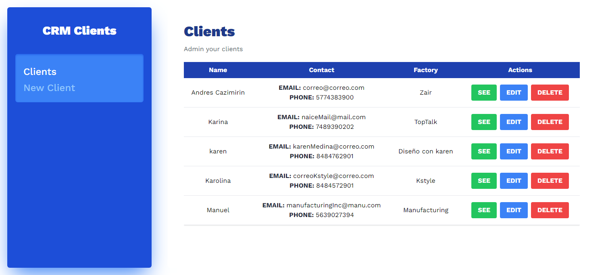
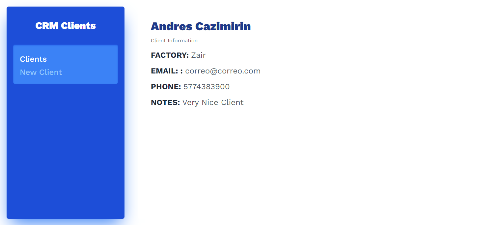
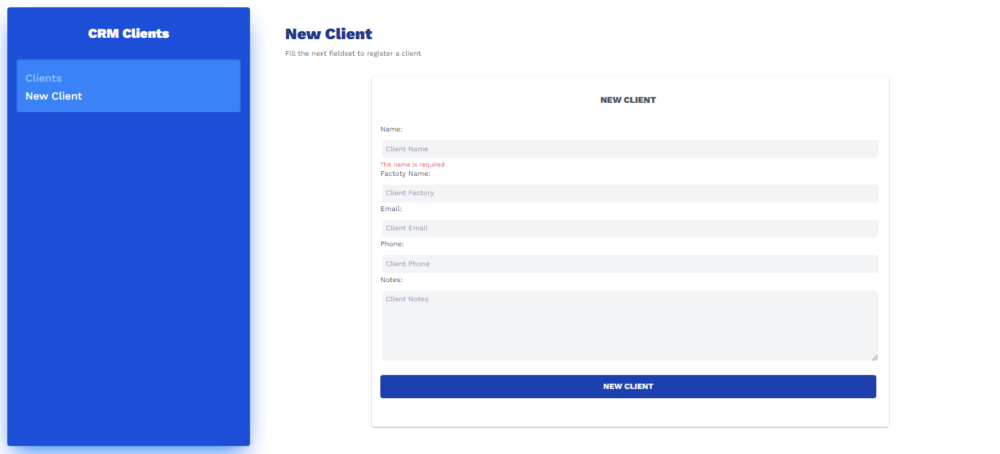
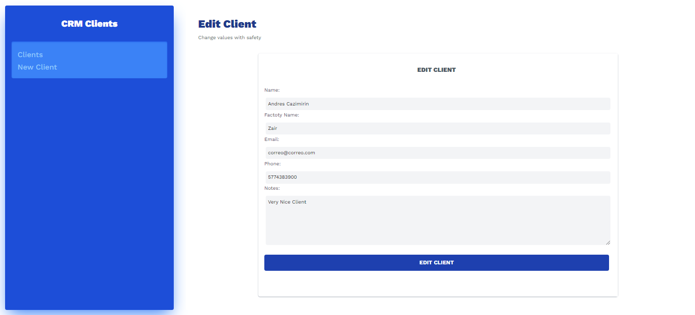

# CRM with React 

This project is build with Vite 
Vite is awesome tool make for the Vue.js Owner

This tool allows us make more ease projects with any Framework of JS

### How was make it?
Install:
Vite
> npm init vite@latest
* add the name of a folder
* go to the folder and install npm
> npm install

## How run this project?
Run:
> npm run dev

*This proyects is build with Tailwind CSS*

## Routers

When we have a multiple pages in our project we can use the Routers to make the navigation between the pages
React Router is a library that allows us to make the navigation at a simple way

### What is it?

Whit a library of Routing we can have a lot of URLs to show so components, and then block to access to meny pages

#### Links

Usually we use `<a>` tag to make the link to the some page, but with Raect Router we use special tag `<Link>` or `<newLink>`
This is to have a better performance
In Links tag intead of use href property we need to use To property
#### Location

Is a way of make a state of the page and hes function is `useLocation()`
Your properties are:
`Hash`: is the URL with the hash
`Pathname`: is the URL without the hash
`Search`: is the URL with the search
`State`: is the URL with the state
`Key`: is the URL with the key

### Librery of Routing

* React Router - V6 (it's with React Router) - Makers of Remix Run  
* React Location - Creators of React Query
* Gastsby user our self router
* Next.js user our self router

## Forms

This Project includes a library for creating forms in React 
**Some Library to be exist:**
* Formik 
* React-hook-form 

## Images 

